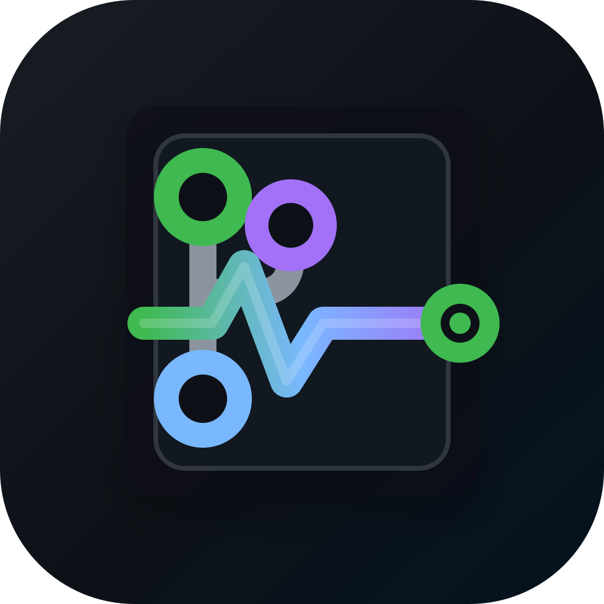

<p align="center">
  
</p>

# GitPulse

GitPulse is a macOS menu bar app for tracking GitHub workflow activity without keeping GitHub open all day. It is built with SwiftUI, AppKit menu bar APIs, SwiftData, and GitHub's API.

The app is early, but usable for authored pull requests today. It also includes demo activity so contributors can test the UI without needing active GitHub issues, pull requests, CI failures, or mentions on their own account.

## Features

- Menu bar popover for GitHub workflow activity
- GitHub personal access token sign in with macOS Keychain storage
- Fetches open pull requests authored by the signed-in user
- PR status labels such as `waiting for checks`, `waiting for approval`, `checks failed`, and `ready`
- Activity visibility controls for PRs, issues, CI/CD, and mentions
- Demo activity mode for testing the UI without real GitHub events
- Customizable global shortcuts
- System, light, and dark appearance modes
- Local SwiftData persistence

## Current Status

GitPulse currently has live GitHub integration for authored pull requests. Issues, CI/CD, mentions, notifications delivery, repository filters, and webhook support are represented in the UI roadmap, but their live GitHub fetchers are not implemented yet.

Demo activity mode exists so users and contributors can test the popover, filtering, row states, and settings behavior before those integrations are complete.

## Requirements

- macOS 14 or newer
- Xcode with Swift 6 toolchain
- A GitHub personal access token for live PR data

## Running Locally

Clone the repo, then run:

```sh
swift run GitPulse
```

Local SwiftPM runs use the bundled `GitPulse.icns` resource for the app icon.

Run tests with:

```sh
swift test
```

GitPulse is currently a Swift package executable, not a signed `.app` release bundle. Packaging, signing, notarization, and auto-update distribution still need to be added.

## Packaging A Local DMG

Generate the icon, build the release binary, wrap it in a `.app`, and create a DMG:

```sh
scripts/package-release.sh 1.0.0
```

The script writes output to `dist/`. If `SIGN_IDENTITY` is set, it will codesign the app before creating the DMG:

```sh
SIGN_IDENTITY="Developer ID Application: YOUR NAME (TEAMID)" scripts/package-release.sh 1.0.0
```

Notarization still needs to be run separately with Apple's `notarytool`.

## GitHub Token

To use live pull request data, create a GitHub personal access token and connect it in `Settings > Account`.

Recommended classic token scopes for the current app:

- `repo`
- `notifications`
- `read:org`

Tokens are stored in macOS Keychain. Do not commit tokens, screenshots containing tokens, or local Keychain exports.

## Testing Without Real GitHub Activity

If you do not have active PRs, issues, CI runs, or mentions to test with:

1. Open GitPulse.
2. Open `Settings > Notifications`.
3. Turn on `Demo activity`.
4. Use the PR, Issues, CI/CD, and Mentions toggles to show or hide activity types.
5. Open the menu bar popover and test each filter.

Demo mode shows sample rows only. It does not send notifications or write anything to GitHub.

## Project Structure

```text
Sources/
  GitPulseApp/       App bootstrap and executable target
  GitPulseCore/      Reusable app code, UI, models, and services
Tests/
  GitPulseCoreTests/ Unit and integration-style tests
SPEC.md             Architecture and implementation contract
```

Key implementation areas:

- `Sources/GitPulseCore/App`: shared app state and runtime wiring
- `Sources/GitPulseCore/MenuBar`: status item popover and activity rows
- `Sources/GitPulseCore/Settings`: settings window sections
- `Sources/GitPulseCore/Models`: SwiftData models and status mapping
- `Sources/GitPulseCore/Services`: GitHub, sync, Keychain, and shortcut services

## Contributing

Contributions are welcome once the repository license is added. Until then, treat the code as source-available for review and collaboration, not formally open source.

Before opening a pull request:

1. Read `SPEC.md`.
2. Keep files under 500 lines.
3. Keep changes focused on one feature or fix.
4. Add or update tests for behavior changes.
5. Run `swift test`.

Good first contribution areas:

- Live issue fetching
- Live notification fetching
- CI/CD status integration beyond authored PR rollups
- Native macOS notification delivery
- Release packaging and app signing
- Screenshots and documentation
- Accessibility review

## Roadmap

- Signed `.app` releases
- GitHub issue activity
- GitHub mentions
- CI/CD event feed
- Native notification delivery
- Repository filters
- Webhook receiver
- Auto-update support
- Contributor docs and screenshots

## Release Status

GitPulse is not packaged for end-user downloads yet. The next release milestone is to create a signed and notarized macOS `.app`, wrap it in a DMG, and publish it through GitHub Releases. See `docs/RELEASE.md` for the release checklist.

## License

GitPulse is released under the MIT License. See `LICENSE`.
